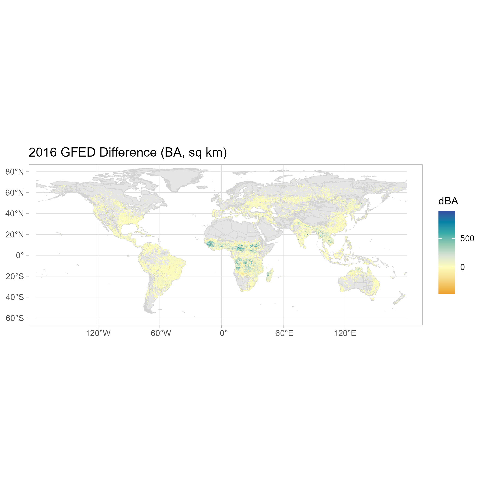
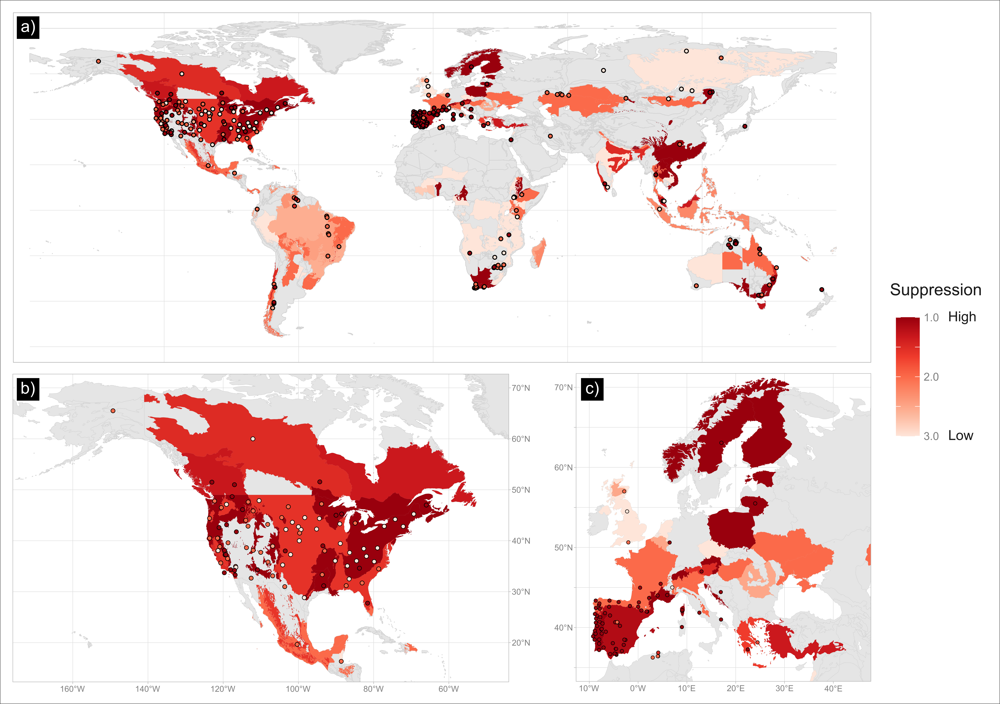
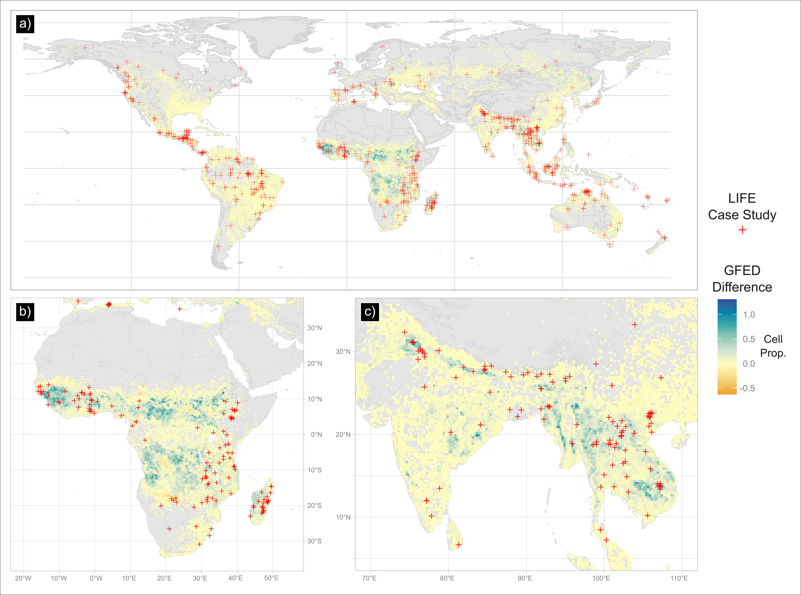

# Human Fire Data

https://zenodo.org/badge/DOI/10.5281/zenodo.19485181.svg](https://doi.org/10.5281/zenodo.19485181)

This repository contains code for mapping three global databases of human fire, plus data from the Global Fire Emissions Database:
- [mapping.r](mapping.r) handles [DAFI](https://doi.org/10.6084/m9.figshare.c.5290792.v4), [LIFE](https://doi.org/10.17637/rh.c.5469993) and [GFUS](https://doi.org/10.5281/zenodo.10671047) 
- [GFED.r](GFED.r) handles [GFED4](https://www.globalfiredata.org/related.html#gfed4) and [GFED5](https://www.globalfiredata.org/data.html) 

|  |
|:--:| 
| Difference in Burned Area between GFED5 and GFED4s, for 2016. See [Fig-GFED.R](Fig-GFED.R) |

It also contains high-resolution figures from outputs of code that were subsequently edited in inkscape, as follows:

|  |
|:--:|
| Suppression Level from DAFI (case study points) and GFUS (region polygons) data. See [Fig-DAFI-GFUS.r](Fig-DAFI-GFUS.r) |

|  |
|:--:|
| Difference in burned area (cell fraction) between GFED4s and GFED5 products (grid data) with location of LIFE case study locations (points). See [Fig_GFED-LIFE.r](Fig_GFED-LIFE.r) |
